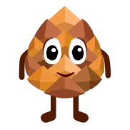
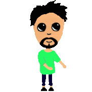
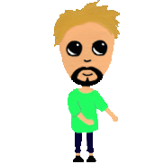
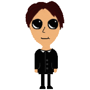
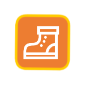
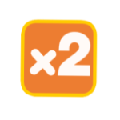

Документация пользователя
-------------------------

*******************************************************
Управление персонажем
*******************************************************
**W** - Движение вверх

**A** - Движение влево

**S** - Движение вниз

**D** - Движение вправо

**P** - Пауза

**F** - ???

*******************************************************
Режимы игры
*******************************************************
* **Обычный**
* **Countdown** (персонаж двигается по полю, пока не истечет время)
* **Inversed** (Режим движения персонажа в обратную сторону)
* **Сетевой**

*******************************************************
Персонажи
*******************************************************
**Шишка**

**Роман Андреевич** (темная и светлая темы)

**Андрей Александрович**

**Елена Дмитриевна**

*******************************************************
Бонусы
*******************************************************

**Щит** (защищает персонажа от любых препятствий на поле)

**Буст** (ускорение персонажа)

**х2** (очки, получаемые во время работы бонуса, удваиваются)

